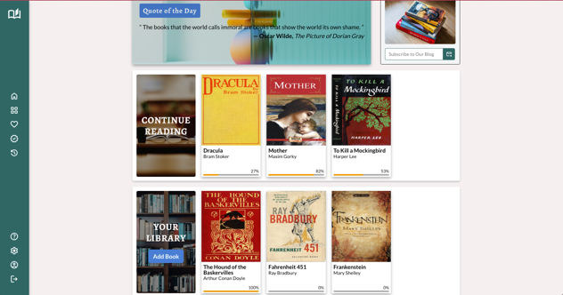

# Library App

## Library Project for [The Odin Project](https://www.theodinproject.com/lessons/node-path-javascript-library)

## Overview

This is a small Library App where users can add or remove books from their library. The app is built with HTML, CSS, and JavaScript.

There's a Navbar on the left side of the page which contains links (non-functional) to the other pages. There are two main sections in the main section of the page: The Library section and the Continue Reading section which are displayed like a grid of books. On the top of the page you can see a search bar and a section for profile details of the user (They're also non-functional at the moment).

Upon page finished loading, user will see that some books are already added in 'Continue Reading' and 'Library' sections. User can add more books by clicking 'Add Book' button in 'Your Library' section. A form will appear and user can fill out the form to add a new book.

User can also update book details by clicking 'Update' button and remove a book by using 'Delete' button which show up on the book card when hovering over it. Clicking the 'Update' button will show a form where user can update the book details except the title of the book. When user clicks the 'Delete' button, the book will be removed from the library and the book card will be removed from the DOM.

## Screenshots

### Library App

## Credits

### Icons

1. All icons are from [Google Fonts](https://fonts.google.com/icons) website.

### Images

1. Quote Background Image - 'diagram' by Vimal S on [Unsplash](https://unsplash.com/photos/diagram-uKPBLsL7Nvs)
2. Subscribe Image - 'black framed eyeglasses on red and yellow book' by Aneta Pawlik on [Unsplash](https://unsplash.com/photos/black-framed-eyeglasses-on-red-and-yellow-book-Wo2D0_vGgQ4)
3. Continue Reading Background Image - 'book page on brown wooden table' by Olena Bohovyk on [Unsplash](https://unsplash.com/photos/book-page-on-brown-wooden-table-Q89yGcVthUU)
4. Library Background Image - 'assorted-title book in bookcase' by Dakota Corbin on [Unsplash](https://unsplash.com/photos/assorted-title-book-in-bookcase-a-AWnRtwlWM)
5. Dracula Cover Image - 'A reproduction of the first edition cover of Dracula (1897)' by Unknown on [Wikimedia](https://commons.wikimedia.org/wiki/File:Dracula_1st_ed_cover_reproduction.jpg)
6. Mother Cover Image - 'Cover of the book' from [Amazon](https://www.amazon.com/Mother-Maxim-Gorky/dp/935223006X)
7. To Kill a Mockingbird Cover Image - 'Cover of the book showing title in white letters against a black background in a banner above a painting of a portion of a tree against a red background' by Shirley Smith from [Wikipedia Commons](<https://en.wikipedia.org/wiki/To_Kill_a_Mockingbird#/media/File:To_Kill_a_Mockingbird_(first_edition_cover).jpg>)
8. The Hound of the Baskervilles Cover Image - 'Book Cover The Hound of the Baskervilles First edition 1902' by
   Alfred Garth Jones from [Wikimedia Commons](https://commons.wikimedia.org/wiki/File:Cover_(Hound_of_Baskervilles,_1902).jpg)
9. Fahrenheit 451 Cover Image - 'Cover from the hardcover (clothbound) first edition' by Unknown from [Wikimedia Commons](https://en.wikipedia.org/wiki/File:Fahrenheit_451_1st_ed_cover.jpg)
10. Frankenstein Cover Image - 'Cover of the book'  from [Amazon](https://www.amazon.com/Frankenstein-Original-Mary-Wollstonecraft-Shelley/dp/B084WPW3D3)
11. Coffee Cover Image - 'blue ceramic coffee cup and white saucer' by Annie Spratt on [Unsplash](https://unsplash.com/photos/blue-ceramic-coffee-cup-and-white-saucer-PM4Vu1B0gxk)
12. Painting Cover Image - 'Painting' by Markus Spiske on [Unsplash](https://unsplash.com/photos/yellow-orange-red-green-and-blue-abstract-painting-k0rVudBoB4c)
13. Flowers Cover Image - 'flowers beside yellow wall' by Mona Eendra on [Unsplash](https://unsplash.com/photos/flowers-beside-yellow-wall-vC8wj_Kphak)
14. Leaves Cover Image - 'red plant leaves' by Erol Ahmed on [Unsplash](https://unsplash.com/photos/red-plant-leaves-wKTF65TcReY4)
15. Color Paper Cover Image - 'a close up of a colorful object on a table' by Jakub Żerdzicki on [Unsplash](https://unsplash.com/photos/a-close-up-of-a-colorful-object-on-a-table-vsmp8jLD4aM)
16. Roses Cover Image - 'shallow focus photography of red and pink roses' by Annie Spratt on [Unsplash](https://unsplash.com/photos/shallow-focus-photography-of-red-and-pink-roses-wuc-KEIBrdE)
17. Night Sky Cover Image - 'shooting star in night sky' by Diego PH on [Unsplash](https://unsplash.com/photos/shooting-star-in-night-sky-5LOhydOtTKU)
18. Christmas Cover Image - 'photo of gray concrete pavement' by Annie Spratt on [Unsplash](https://unsplash.com/photos/photo-of-gray-concrete-pavement-X4l3CjcDvic)
19. Sunflower Cover Image - 'sunflower with clear glass vase on gray table' by NordWood Themes on [Unsplash](https://unsplash.com/photos/sunflower-with-clear-glass-vase-on-gray-table-bp1ydkAtwFI)
